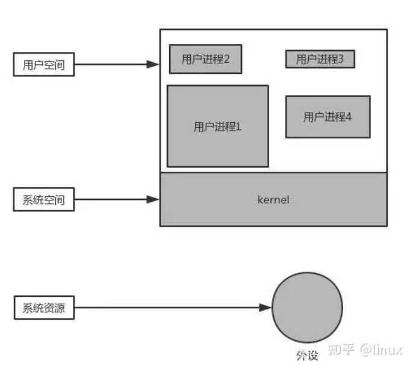
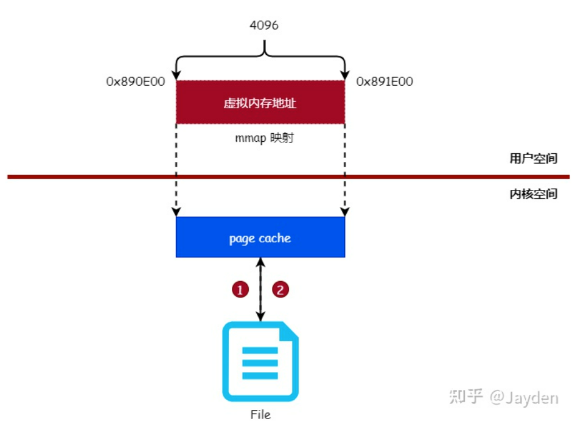

# Study for the file systerm

## 一. mmap 原理及应用：

传统文件读写分三步：将文件读到内存、在内存中修改数据、将内存中的文件写回到磁盘中：参考 块链、bpt 的实现。


```cpp
read(fd, buf, size);
//do something
write(fd, buf, size);
```
而mmap是直接在用户空间读写**页缓存（page cache）**免去将页缓存的数据复制到用户空间缓冲区的过程。

> 关于内核缓存区和用户缓存区：linux系统分为用户空间和内核空间：这两者分别都有一个缓存区，分别是用户缓存区和内核缓存区。

他们的关系如下：



内核缓存区很大，一般由物理内存决定。每次内核缓存每次和磁盘交互大小都是 4096 byte的整数倍。每过一定时间，内核缓存区的数据都会被写入到磁盘中以保证安全性。

**fflush** 把进程缓冲区的数据刷新到内核缓冲区，**fsync** 把内核缓冲区的数据刷新到磁盘。而这些系统资源，在用户进程中是无法被直接访问的，只能通过操作系统来访问，所以也把操作系统提供的这些功能成为：“系统调用”。

用户进程通过系统调用访问系统资源的时候，需要切换到内核态，而这对应一些特殊的堆栈和内存环境，必须在系统调用前建立好。而在系统调用结束后，cpu会从核心模式切回到用户模式，而堆栈又必须恢复成用户进程的上下文。而这种切换就会有大量的耗时。

所以我们要尽量避免这种切换。

在读取文件时，会先申请一块内存数组，称为buffer，然后每次调用read，读取设定字节长度的数据，写入buffer。（用较小的次数填满buffer）。之后的程序都是从buffer中获取数据，当buffer使用完后，在进行下一次调用，填充buffer。所以说：用户缓冲区的目的是为了减少系统调用次数，从而降低操作系统在用户态与核心态切换所耗费的时间。除了在进程中设计缓冲区，内核也有自己的缓冲区。

读取步骤一般如下：当一个用户进程要从磁盘读取数据时，内核一般不直接读磁盘，而是将内核缓冲区中的数据复制到进程缓冲区中。

但若是内核缓冲区中没有数据，内核会把对数据块的请求，加入到请求队列，然后把进程挂起，为其它进程提供服务。

等到数据已经读取到内核缓冲区时，把内核缓冲区中的数据读取到用户进程中，才会通知进程，当然不同的io模型，在调度和使用内核缓冲区的方式上有所不同。

回到`mmap`：mmap是一个系统调用，它将用户空间虚拟的内存地址和文件的缓存进行映射，使得对映射后的虚拟内存地址进行读写操作等同于对文件进行读写操作。原理如图：



解除映射或者调用`msync`函数，可以主动将内存中的数据写回到磁盘中。否则，进程退出时，或到达设定时间时会写入磁盘。

### mmap的使用

其函数原型为：

```c
void *mmap(void *addr, size_t length, int prot, int flags, int fd, off_t offset);
```

各参数含义：

* `addr` :指定映射的虚拟地址，通常设置为`NULL`，表示由系统自动分配和返回。
* `length` :映射的长度，单位是字节。
* `prot` :映射区域的保护方式，有如下几种组合(可组合)：
  * `PROT_EXEC` :可执行的。
  * `PROT_READ` :可读的。
  * `PROT_WRITE` :可写的。
  * `PROT_NONE` :不可访问的。
* `flags` :影响映射区域的各种特性，有如下几种组合(可组合)：
  * `MAP_SHARED` :对映射区域的写入数据会复制回文件内。
  * `MAP_PRIVATE` :对映射区域的写入数据不会写回文件内。而会在写操作时建立一个副本（Copy on Write）。
  * 。。。
* `fd` :进行映射的文件描述符。（句柄：是windows下的概念；而文件描述符是 POSIX 标准下的概念）
* `offset` :文件偏移量，从何处开始进行映射。

使用方式具体看task1.

此外还有

```c
int munmap(void *addr, size_t length);
//解除映射，起点为addr， 长度为length
int msync(const void *start, size_t length, int flags);
//主动将内存中的数据写回到磁盘中
/*
flags:
MS_ASYNC : 请Kernel快将资料写入。
MS_SYNC : 在msync结束返回前，将资料写入。
MS_INVALIDATE : 让核心自行决定是否写入，仅在特殊状况下使用
*/
```
这里特别注意匿名映射：匿名映射是没有文件的映射。该内存地址被初始化为 $0$.

两种方式创建匿名映射：

1. fd=-1 且 flags= MAP_ANONYMOUS|MAP_SHARED 
   这种情况下，mmap() 函数最终调用 shmem_zero_setup() 来打开一个 "/dev/zero" 特殊的设备文件。
2. 直接打开 "/dev/zero" 设备文件，然后使用这个文件句柄来创建 mmap

### Linux 文件锁函数 ———— open(), fcntl()

和互斥锁差不多的概念：文件锁就是当文件在写的时候组织其他的需要写或者读文件的进程来操作这个文件。

#### 创建锁文件
使用 `open` 系统调用来创建一个锁文件，在调用 `open` 时，flag需要增加参数 `O_CREAT` 和 `O_EXCL` 标志。`O_CREAT` 表示如果文件存在则使用，不存在则创建；`O_EXCL` 表示检查文件是否存在，如果不存在则新建，如果文件存在则返回错误。这样就可以保证锁文件只有一个。

我们通过文件系统即可实现锁：某个线程进入临界区时创建一个这样的锁文件即可，退出临界区时再通过使用unlink系统调用删除这个锁文件。也就是说锁文件只是充当指示器的作用。

但是感觉有点牛刀小用的感觉，一个文件仅仅起到了信号量的作用。

#### 区域锁定

我们还有一个问题，就是如果同一个文件有多个进程需要对它进行读写，而一个文件同一时间只能被一个进程进行写操作，但是多个进程读写的区域互不相关，如果总是要等一个进程写完其他的进程才能对其进行读写，效率又太低，那么是否可以让多个进程同时对文件进行读写以提高数据读写的效率呢？（实现多进程对同文件的不相交区域同时读写）

区域锁定就是把文件中的某个区域锁定，但其他进程仍然可以访问到其他未被锁定的区域。

##### What is fcntl()?

Linux下的每个文件都有一个文件描述符，它规定了文件的某些属性，而且我们可以通过文件描述符对文件进行操作。

`fcntl()` 函数用来操作文件描述符的一些特性，包括：文件状态标志、文件访问模式和文件打开方式等。

### ioctl()
